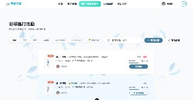
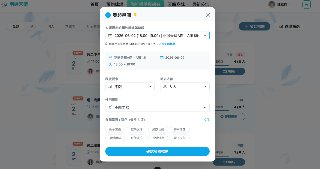
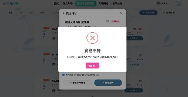
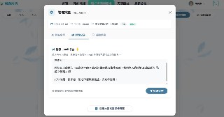
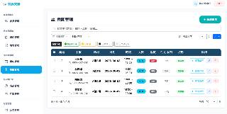

# 🏸 羽球館預約管理系統 — 前端

> 一站式羽球場地預約與零打揪團平台，提供會員預約場地、瀏覽商品、發起與加入臨打揪團等完整功能。

## 📌 專案簡介

本專案為資展國際 EEIT 跨域 Java 軟體工程師養成班的結訓專題，由 5 人團隊協作完成。系統採用**前後端分離架構**，前端使用 Vue 3，後端使用 Spring Boot + SQL Server。

**我主要負責的模組：臨打揪團 (Pickup Game)**
- 從資料庫 ERD 設計、Spring Boot RESTful API 開發，到 Vue 3 前端互動介面，獨立完成全端開發。

## ✨ 功能亮點（臨打揪團模組）

| 功能 | 說明 |
|------|------|
| 揪團 CRUD | 主揪可發起揪團，設定人數上限、程度與性別限制 |
| 一鍵報名 / 退出 | 球友可快速報名，系統即時更新名額進度條 |
| 時間衝突檢查 | 報名前自動比對預約與已報名場次，防止時段重疊 |
| 多條件篩選 | 支援日期、關鍵字、程度、性別等複合篩選，搭配分頁與 URL 同步 |
| Quick View 快速預覽 | 不跳轉即可查看揪團詳情與報名 |
| 主揪管理面板 | 開關報名、踢除成員、群發 Email 公告 |
| 聯絡主揪 | 報名者透過系統代發 Email 聯繫主揪，保護雙方個資 |
| 登入防呆 | 未登入使用者觸發報名時，彈出登入視窗並在登入後自動續接操作 |
| 後台管理 | 管理員可總覽所有揪團，支援批次取消、匯出 Excel / CSV |

## 📸 系統實機畫面 (UI Showcase)

### 1. 揪團列表 (首頁快速預覽與多條件篩選)


### 2. 發起臨打揪團 (自訂程度、性別、人數上限)


### 3. 報名防呆機制 (自動攔截資格不符與時間衝突)


### 4. 揪團管理與群發公告 (保護個資的聯絡系統)


### 5. 後台揪團總覽 (管理員權限)


## 🛠️ 技術棧

### 前端（本 Repo）
- **框架**：Vue 3 (Composition API + `<script setup>`)
- **狀態管理**：Pinia
- **路由**：Vue Router
- **HTTP 請求**：Axios
- **UI 框架**：Bootstrap 5 + Bootstrap Icons
- **彈窗**：SweetAlert2
- **圖表**：Chart.js + vue-chartjs
- **建構工具**：Vite
- **其他**：LINE Pay 串接、Google 第三方登入、WebSocket (STOMP)、XLSX 匯出

### 後端（獨立 Repo）
- Java 17 / Spring Boot
- Spring Data JPA / Hibernate
- SQL Server
- RESTful API

## 📁 專案結構

```
src/
├── api/                    # API 請求定義
├── assets/                 # 靜態資源（圖片、字型等）
├── components/
│   ├── admin/              # 後台共用元件（側欄、標頭）
│   ├── common/             # 通用元件（Google Map 等）
│   ├── frontend/           # 前台元件（揪團卡片、建立揪團 Modal 等）
│   └── payment/            # 金流相關元件
├── composables/            # 可複用邏輯（Vue Composables）
│   ├── usePickupGameApi.js # 揪團 API 封裝（CRUD、報名、聯絡主揪）
│   ├── useTimeConflict.js  # 時間衝突檢查邏輯
│   ├── useGameFilter.js    # 揪團篩選 + 排序 + 分頁
│   ├── useDateFilter.js    # 日期範圍篩選
│   ├── useExport.js        # 資料匯出（Excel / CSV）
│   └── useLinePay.js       # LINE Pay 金流串接
├── layouts/                # 頁面佈局（前台 / 後台）
├── router/                 # 路由設定
├── stores/                 # Pinia 狀態管理
│   ├── member.js           # 會員登入狀態
│   └── cart.js             # 購物車狀態
└── views/
    ├── frontend/           # 前台頁面（首頁、預約、揪團、結帳等）
    └── admin/              # 後台頁面（儀表板、場地管理、揪團管理等）
```

## 🏗️ 架構設計理念

### Composable 模式（關注點分離）
將商業邏輯從 Vue 元件中抽離，封裝為獨立的 Composable 函式：

```javascript
// 範例：在多個頁面共用揪團 API 邏輯
import { usePickupGameApi } from '@/composables/usePickupGameApi'
import { useTimeConflict } from '@/composables/useTimeConflict'

const { pickupGames, fetchGames, joinPickupGame } = usePickupGameApi()
const { checkTimeConflict } = useTimeConflict()
```

- **元件層**：只負責 UI 渲染與使用者互動
- **Composable 層**：封裝 API 請求、資料處理、商業邏輯
- **Store 層（Pinia）**：管理跨元件的全域狀態（登入資訊、購物車）

### 報名防呆機制
系統內建多層防呆，確保報名流程的資料正確性：
1. **性別限制**：根據揪團設定的性別要求自動攔截
2. **程度限制**：根據揪團設定的程度門檻給予提示
3. **時間衝突**：比對該會員所有預約與已報名場次，防止同時段重複報名
4. **名額已滿**：即時計算剩餘名額，滿額自動關閉報名按鈕

## 🚀 快速開始

### 環境需求
- Node.js >= 20.19.0
- npm

### 安裝與啟動

```bash
# 1. 安裝依賴
npm install

# 2. 啟動開發伺服器
npm run dev

# 3. 開啟瀏覽器前往
# http://localhost:5173
```

> ⚠️ 本專案為前端部分，需搭配後端 Spring Boot 伺服器才能正常運作。

## 👥 團隊分工

| 成員 | 負責模組 |
|------|----------|
| **徐蕊薇（我）** | 臨打揪團模組（全端）、報名防呆機制、時間衝突檢查、聯絡主揪系統 |
| 組員 B | 場地預約模組 |
| 組員 C | 商品與購物車模組 |
| 組員 D | 會員系統與權限管理 |
| 組員 E | 後台管理與金流串接 |

## 📄 License

本專案為學術專題作品，僅供學習與面試展示使用。
